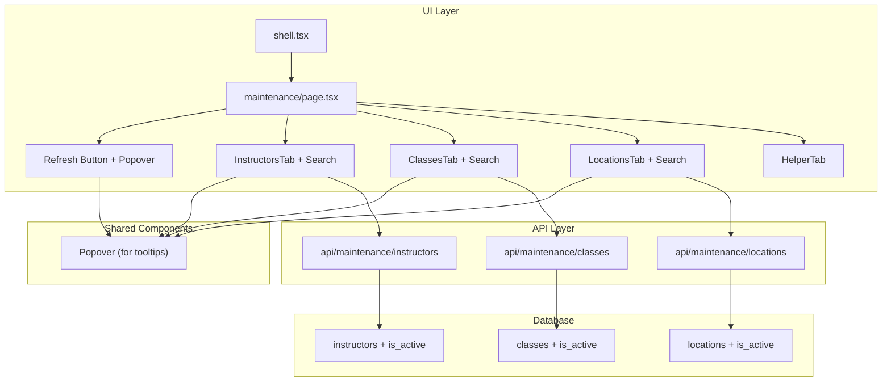

# Maintenance Page Documentation

**Feature:** Data Management for Branch Managers  
**Status:** Implemented  
**Last Updated:** December 14, 2024 (v2)  
**Related PRD Section:** Section 6 - Manager Web Dashboard

---

## Table of Contents

1. [Overview](#overview)
2. [Purpose & Business Context](#purpose--business-context)
3. [File Structure](#file-structure)
4. [Database Schema](#database-schema)
5. [API Reference](#api-reference)
6. [UI Components](#ui-components)
7. [Search & Filtering](#search--filtering)
8. [Feature Details](#feature-details)
9. [Theme Integration](#theme-integration)
10. [Future Considerations](#future-considerations)
11. [Troubleshooting](#troubleshooting)

---

## Overview

The Maintenance page provides Branch Managers with CRUD (Create, Read, Update, Delete) operations for managing reference data used in scheduling:

- **Instructors** - People who teach classes
- **Classes** - Types of classes offered (Yoga, Spin, BODYPUMP™, etc.)
- **Locations** - Rooms and studios where classes are held
- **Helper** - Step-by-step guide for managers

### Key Design Decisions

1. **Soft Delete**: Instead of permanently deleting records, we use an `is_active` flag. This preserves historical data for reports and prevents orphaned foreign key references.

2. **Real-time Validation**: Duplicate checking happens as the user types (debounced at 300ms) with visual feedback.

3. **Nickname Suggestions + Instructor ID**:
   - Nicknames are **A–Z only**, **uppercase**, **min 2 / max 8 characters**, and **unique within the branch scope** (owned + shared).
   - When adding a new instructor, the UI offers **5 suggested nicknames** derived from first + last name, with override capability.
   - On save, the system generates a stable **Instructor ID** (`readable_id`) in the format `ASSOC-BRANCHSHORT-NICKNAME` (e.g., `GROC-ES-JOHNDOE`).
   - After creation, **Nickname** and **Instructor ID** are **not editable**.

4. **Trademark Symbols**: Class names can include ™ ® ℠ © symbols for licensed fitness programs.

---

## Purpose & Business Context

### Why This Feature Exists

Before scheduling classes, a Branch Manager needs to set up:
- Who can teach (Instructors)
- What can be taught (Classes)  
- Where classes can be held (Locations)

This data is referenced by the **Scheduling** feature (future task) and the **Reports** feature (existing).

### Relationship to Other Features

```
┌─────────────────┐
│   Maintenance   │ ← You are here
│  (Reference Data)│
└────────┬────────┘
         │
         ▼
┌─────────────────┐     ┌─────────────────┐
│   Scheduling    │────▶│  class_sessions │
│  (Future Task)  │     │     (Data)      │
└─────────────────┘     └────────┬────────┘
                                 │
                                 ▼
                        ┌─────────────────┐
                        │    Reports      │
                        │   (Analytics)   │
                        └─────────────────┘
```

---

## File Structure

### Frontend Files

```
web/src/
├── app/
│   └── maintenance/
│       ├── page.tsx              # Main page with tab navigation
│       ├── instructors-tab.tsx   # Instructors CRUD with nickname suggestions
│       ├── classes-tab.tsx       # Classes CRUD with trademark picker
│       ├── locations-tab.tsx     # Locations CRUD with duplicate validation
│       └── helper-tab.tsx        # Manager tutorial/guide
│
├── components/
│   └── shell.tsx                 # Updated with Maintenance nav item
│
└── app/api/maintenance/
    ├── instructors/
    │   └── route.ts              # GET, POST, PUT, PATCH for instructors
    ├── classes/
    │   └── route.ts              # GET, POST, PUT, PATCH for classes
    └── locations/
        └── route.ts              # GET, POST, PUT, PATCH for locations
```

### Database Files

```
supabase/migrations/
└── 20251214_add_is_active_columns.sql   # Adds is_active to 3 tables
```

---

## Database Schema

### Migration Applied

**File:** `supabase/migrations/20251214_add_is_active_columns.sql`

```sql
-- Added columns
ALTER TABLE instructors ADD COLUMN is_active boolean NOT NULL DEFAULT true;
ALTER TABLE classes ADD COLUMN is_active boolean NOT NULL DEFAULT true;
ALTER TABLE locations ADD COLUMN is_active boolean NOT NULL DEFAULT true;

-- Partial indexes for efficient filtering
CREATE INDEX idx_instructors_is_active ON instructors(is_active) WHERE is_active = true;
CREATE INDEX idx_classes_is_active ON classes(is_active) WHERE is_active = true;
CREATE INDEX idx_locations_is_active ON locations(is_active) WHERE is_active = true;
```

### Table Schemas (Relevant Columns)

#### instructors
| Column | Type | Required | Notes |
|--------|------|----------|-------|
| id | uuid | Yes | Primary key |
| branch_id | uuid | No | FK to branches |
| first_name | text | Yes | Display on forms |
| last_name | text | Yes | Display on forms |
| nickname | text | Yes | **A–Z only**, uppercase, **min 2 / max 8**, unique per branch scope; shown on schedules |
| readable_id | text | Yes | Stable Instructor ID: `ASSOC-BRANCHSHORT-NICKNAME` |
| raw_name | text | Yes | Auto-generated: "first_name last_name" |
| is_active | boolean | Yes | Default: true |

#### classes
| Column | Type | Required | Notes |
|--------|------|----------|-------|
| id | uuid | Yes | Primary key |
| name | text | Yes | Unique, can include ™ ® ℠ © |
| description | text | No | Optional details |
| category | text | No | e.g., "Cardio", "Strength", "Yoga" |
| is_active | boolean | Yes | Default: true |

#### locations
| Column | Type | Required | Notes |
|--------|------|----------|-------|
| id | uuid | Yes | Primary key |
| code | text | Yes | Unique, short (e.g., "MB", "STUDIO") |
| name | text | Yes | Unique, full name |
| is_active | boolean | Yes | Default: true |

---

## API Reference

### Instructors API

**Base URL:** `/api/maintenance/instructors`

#### GET - List Instructors
```
GET /api/maintenance/instructors?include_inactive=true
```

Query Parameters:
- `include_inactive` (boolean): Include deactivated instructors

Response: Array of instructor objects

#### GET - Check Nickname Availability
```
GET /api/maintenance/instructors?check_nickname=JOHN&first_name=John&last_name=Smith&branch_id=uuid
```

Response:
```json
{
  "exists": true,
  "suggestions": ["JOHNSMITH", "JOHNSMIT", "JOHNSMI", "JSMITH", "JOHNSMITHA"]
}
```

#### GET - Suggest Nicknames (New Instructor)
```
GET /api/maintenance/instructors?suggest_nicknames=true&first_name=John&last_name=Smith&branch_id=uuid
```

Response:
```json
{
  "suggestions": ["JOHNSMITH", "JOHNSMIT", "JOHNSMI", "JSMITH", "JOHNSMITHA"]
}
```

#### POST - Create Instructor
```json
{
  "first_name": "John",
  "last_name": "Smith",
  "nickname": "JOHNSMITH",
  "branch_id": "optional-uuid"
}
```

#### PUT - Update Instructor
```json
{
  "id": "instructor-uuid",
  "first_name": "John",
  "last_name": "Smith"
}
```

#### PATCH - Toggle Active Status
```json
{
  "id": "instructor-uuid",
  "is_active": false
}
```

---

### Classes API

**Base URL:** `/api/maintenance/classes`

#### GET - List Classes
```
GET /api/maintenance/classes?include_inactive=true
```

#### GET - Check Name Availability
```
GET /api/maintenance/classes?check_name=BODYPUMP™&exclude_id=uuid
```

Response:
```json
{
  "exists": false
}
```

#### POST - Create Class
```json
{
  "name": "BODYPUMP™",
  "description": "Barbell workout",
  "category": "Strength"
}
```

#### PUT - Update Class
```json
{
  "id": "class-uuid",
  "name": "BODYPUMP™",
  "category": "Strength Training"
}
```

#### PATCH - Toggle Active Status
```json
{
  "id": "class-uuid",
  "is_active": false
}
```

---

### Locations API

**Base URL:** `/api/maintenance/locations`

#### GET - List Locations
```
GET /api/maintenance/locations?include_inactive=true
```

#### GET - Check Code Availability
```
GET /api/maintenance/locations?check_code=MB&exclude_id=uuid
```

#### GET - Check Name Availability
```
GET /api/maintenance/locations?check_name=Main Building&exclude_id=uuid
```

#### POST - Create Location
```json
{
  "code": "MB",
  "name": "Main Building"
}
```

#### PUT - Update Location
```json
{
  "id": "location-uuid",
  "code": "MAIN",
  "name": "Main Building"
}
```

#### PATCH - Toggle Active Status
```json
{
  "id": "location-uuid",
  "is_active": false
}
```

---

## UI Components

### Main Page (`page.tsx`)

- **Header**: Title "Maintenance" with refresh button beside it
- **Refresh Button**: 
  - Small circular icon button (RotateCcw icon, same as Reports page)
  - Positioned directly to the right of the "Maintenance" header
  - Uses CTA background color with hover lift effect
  - **Popover on hover**: Shows context-specific message based on active tab:
    - Instructors: "Reload instructors list from the database"
    - Classes: "Reload classes list from the database"
    - Locations: "Reload locations list from the database"
  - **Disabled state**: Grayed out and non-interactive when Helper tab is selected
- **Tab Pills**: Toggle between Instructors, Classes, Locations, Helper
- **Tab Content Area**: Renders the active tab component

### Tab Components (Common Pattern)

Each tab (Instructors, Classes, Locations) follows this structure:
1. **Search bar** with text input and filter options (Narrow, Find, Smart)
2. **Header bar** with title, "Show inactive" checkbox, and "Add" button
3. **Inline form** (appears when adding/editing)
4. **Data table** with columns for fields, status badge, and action buttons

### Form Validation States

```
┌─────────────────────────────────────────┐
│ Nickname: [JOHN        ] ⚠️ checking... │  ← Validating
└─────────────────────────────────────────┘

┌─────────────────────────────────────────┐
│ Nickname: [JOHN        ] ✓              │  ← Available (green check)
└─────────────────────────────────────────┘

┌─────────────────────────────────────────┐
│ Nickname: [JOHN        ] ⚠️ In use      │  ← Duplicate (red border)
│ Suggestions: [JOHN S] [J SMITH]         │  ← Clickable chips
└─────────────────────────────────────────┘
```

### Trademark Symbol Picker

```
┌──────────────────────────────────────────────────┐
│ Class Name: [BODYPUMP          ] [™ ▼]           │
│                                  ┌──────────────┐│
│                                  │ ™ Trademark  ││
│                                  │ ® Registered ││
│                                  │ ℠ Service    ││
│                                  │ © Copyright  ││
│                                  └──────────────┘│
└──────────────────────────────────────────────────┘
```

---

## Search & Filtering

The Instructors, Classes, and Locations tabs include a powerful search feature with three filtering modes.

### Search Input

- Located at the top of each tab
- Real-time filtering as you type (no need to press Enter)
- Case-insensitive matching
- **Instructors tab**: Searches across nickname, first name, and last name
- **Classes tab**: Searches by class name only
- **Locations tab**: Searches by location name only

### Filter Options

Three filter modes are available as clickable buttons with popovers:

#### 1. Narrow (Default)
- **Behavior**: Filters the list to show only matching records
- **Use case**: When you want to reduce a long list to just relevant items
- **Visual**: Non-matching items are hidden from view

```
Example: Type "John" in Instructors tab
Before: Shows 50 instructors
After:  Shows only instructors with "John" in their name
```

#### 2. Find
- **Behavior**: Scrolls to and highlights the first match, keeping all records visible
- **Use case**: When you want to locate a specific record without losing context
- **Visual**: First matching row is highlighted with a colored background and scrolled into view

```
Example: Type "Yoga" in Classes tab
Result:  Scrolls to first class containing "Yoga", highlights that row
         All other classes remain visible
```

#### 3. Smart
- **Behavior**: Combines both - filters the list AND highlights the best match
- **Use case**: When you want a focused view with the best match emphasized
- **Visual**: Only matching items shown, with the first match highlighted

```
Example: Type "Studio" in Locations tab
Result:  Shows only locations with "Studio" in name
         First matching location is highlighted
```

### Filter Option Popovers

Each filter button has a popover (on hover) with:
- **One-word title**: The mode name
- **Description**: Brief explanation of what the mode does

### Implementation Details

- **State management**: `searchTerm` and `searchMode` stored in component state
- **Filtering logic**: `useMemo` hook computes `displayedInstructors`/`displayedClasses`/`displayedLocations`
- **Scrolling**: `useEffect` with `scrollIntoView({ behavior: "smooth", block: "center" })`
- **Highlighting**: Conditional CSS classes applied to matching rows
- **Focus management**: Filter buttons maintain focus on search input after selection

### Helper Tab Documentation

The Helper tab includes a "Using the Search Feature" section that explains:
- How to use the search box
- What each filter option does
- Search tips for managers

---

## Feature Details

### Nickname Suggestion Algorithm

Located in: `api/maintenance/instructors/route.ts`

```typescript
function generateNicknameSuggestions(firstName: string, lastName: string): string[] {
  // Generates: JOHN, JOHN S, JOHN SM, J SMITH, JOHN SMITH
  // Filters out any that already exist in the database
}
```

### Soft Delete Behavior

- **Deactivate**: Sets `is_active = false`
- **Activate**: Sets `is_active = true`
- **Effect**: Inactive records are hidden from scheduling dropdowns
- **Reports**: All records (active and inactive) are included in historical reports

### Helper Tab Content

The Helper tab provides non-technical instructions for managers:
- Step-by-step guides for each entity type (Instructors, Classes, Locations)
- Visual examples of nicknames and symbols
- Tips for choosing good location codes
- Explanation of why we "deactivate" instead of "delete"
- **Using the Search Feature**: Guide to search box and filter options (Narrow, Find, Smart)
- Helpful tips including how to use the refresh button

---

## Theme Integration

The Maintenance page uses the existing theme system defined in `theme-settings-provider.tsx`.

### CSS Variables Used

| Variable | Purpose |
|----------|---------|
| `--brand` | Primary brand color |
| `--brand-strong` | Darker brand variant |
| `--brand-soft` | Lighter brand variant |
| `--cta` | Yellow action button color |
| `--cta-foreground` | Text on CTA buttons |
| `--border` | Card/table borders |
| `--muted` | Muted background areas |

### CSS Classes Used

| Class | Purpose |
|-------|---------|
| `bg-panel-gradient` | Header gradient background |
| `bg-card` | Card backgrounds |
| `bg-muted` | Table headers, inactive states |
| `btn-pill` | Rounded button style |
| `report-scroll` | Themed scrollbar for tables |
| `rounded-2xl`, `rounded-3xl` | Consistent border radius |

---

## Future Considerations

### For Scheduling Feature

When implementing the Scheduling feature:

1. **Filter Active Only**: Dropdowns should query with `is_active = true`
   ```typescript
   const { data } = await supabase
     .from("instructors")
     .select("*")
     .eq("is_active", true);
   ```

2. **Foreign Keys**: `class_sessions` references:
   - `instructors.id` via `session_instructors`
   - `classes.id` via `class_id`
   - `locations.id` via `location_id`

3. **Validation**: Prevent scheduling with inactive entities

### Potential Enhancements

- **Bulk import**: CSV upload for classes/locations
- **Branch filtering**: When multi-branch is implemented
- **Audit log**: Track who made changes
- ~~**Search/filter**: Find records in large lists~~ ✓ Implemented (v2)
- **Sort options**: Sort by date, status (name sorting implemented)

---

## Troubleshooting

### Common Issues

**Issue:** Nickname validation not working
- Check: Is `branch_id` being passed correctly?
- Check: API route returning proper response format

**Issue:** Trademark symbols not inserting
- Check: Input ref is properly attached
- Check: Cursor position detection working

**Issue:** Form not closing after save
- Check: `closeForm()` called after successful API response
- Check: No errors preventing state update

**Issue:** Search not finding expected results
- Check: Search is case-insensitive but requires matching text
- Instructors: Searches nickname, first_name, and last_name
- Classes/Locations: Searches name field only

**Issue:** Find mode not scrolling to match
- Check: `highlightedRowRef` is attached to the correct row
- Check: `scrollIntoView` is being called in useEffect

**Issue:** Search input loses focus after clicking filter
- Check: `searchInputRef.current?.focus()` is called in onClick handler
- Check: `pointer-events-none` is set on popover content

**Issue:** Refresh button not working
- Check: Not on Helper tab (button is disabled there)
- Check: `refreshKey` state is updating correctly

### How to Add a New Field

1. **Database**: Add column via migration
2. **API**: Update route to handle new field in GET/POST/PUT
3. **UI**: Add form input in tab component
4. **Validation**: Add any uniqueness/format checks

### How to Add a New Tab

1. Add to `tabs` array in `page.tsx`
2. Create `new-tab.tsx` component
3. Import and render in tab content area
4. Add icon from `lucide-react`

---

## Architecture Diagram



---

## Revision History

| Date | Change | Author |
|------|--------|--------|
| 2024-12-14 | Initial implementation | AI Assistant |
| 2024-12-14 | Added Helper tab | AI Assistant |
| 2024-12-14 | Added search filtering (Narrow, Find, Smart) to Instructors, Classes, Locations tabs | AI Assistant |
| 2024-12-14 | Updated refresh button: moved next to header, added popover with context-specific message, disabled on Helper tab | AI Assistant |
| 2024-12-14 | Updated Helper tab with search feature documentation | AI Assistant |
| 2024-12-14 | Instructors tab now sorted by nickname ascending | AI Assistant |
