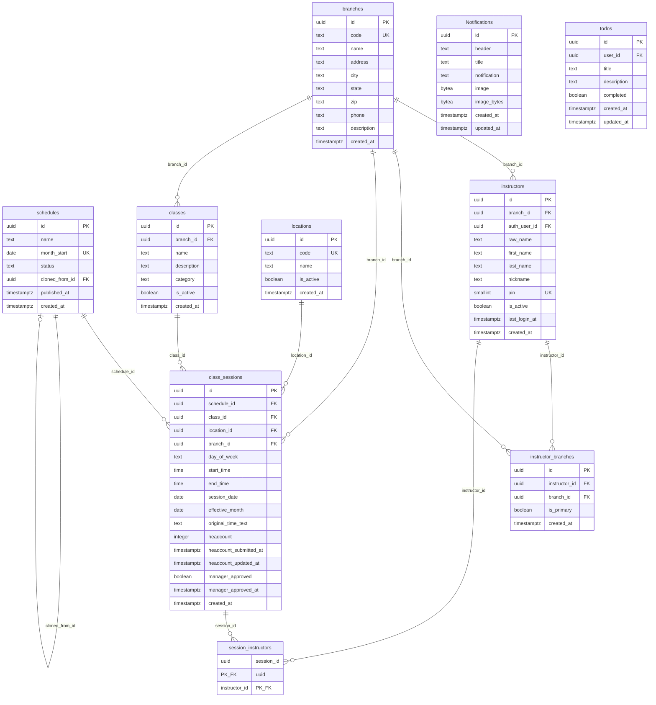
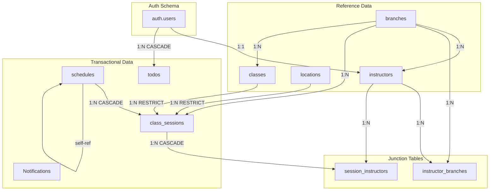

# YMCA Attendance Web - Supabase Database Schema Documentation

**Last Updated:** 2025-01-XX  
**Database:** PostgreSQL (Supabase)  
**Schema Version:** Includes migrations through 20251216

---

## Table of Contents

1. [Overview](#overview)
2. [Table Summary](#table-summary)
3. [Entity Relationship Diagram](#entity-relationship-diagram)
4. [Detailed Table Definitions](#detailed-table-definitions)
5. [Relationships](#relationships)
6. [Indexes](#indexes)
7. [Row Level Security (RLS) Policies](#row-level-security-rls-policies)
8. [Database Functions](#database-functions)
9. [Extensions](#extensions)

---

## Overview

This document provides comprehensive documentation for the YMCA Attendance Web application database schema. The database manages:

- **Branch Management**: YMCA locations and their details
- **Class Scheduling**: Classes, schedules, sessions, and locations
- **Instructor Management**: Instructors, their branch assignments, and authentication
- **Attendance Tracking**: Session headcounts and approval workflows
- **Notifications**: System notifications with images

---

## Table Summary

| Table | Purpose | Type | RLS |
|-------|---------|------|-----|
| `branches` | YMCA branch locations | Reference | No |
| `classes` | Fitness class types (BODYPUMP, Yoga, etc.) | Reference | No |
| `locations` | Room/studio locations within branches | Reference | No |
| `instructors` | Fitness instructors | Reference | Yes |
| `instructor_branches` | Many-to-many: instructors ↔ branches | Junction | No |
| `schedules` | Monthly schedule containers | Transactional | No |
| `class_sessions` | Individual class occurrences with attendance | Transactional | Yes |
| `session_instructors` | Many-to-many: sessions ↔ instructors | Junction | Yes |
| `Notifications` | System notifications | Transactional | No |
| `todos` | User task list (Supabase template) | Transactional | Yes |

---

## Entity Relationship Diagram



---

## Detailed Table Definitions

### branches

YMCA branch locations.

| Column | Type | Nullable | Default | Description |
|--------|------|----------|---------|-------------|
| `id` | uuid | NO | `gen_random_uuid()` | Primary key |
| `code` | text | YES | - | Unique branch code |
| `name` | text | YES | - | Branch name |
| `address` | text | YES | - | Street address |
| `city` | text | YES | - | City |
| `state` | text | YES | - | State |
| `zip` | text | YES | - | ZIP code |
| `phone` | text | YES | - | Phone number |
| `description` | text | YES | - | Branch description |
| `created_at` | timestamptz | YES | `now()` | Record creation timestamp |

**Constraints:**
- `branches_pkey` - PRIMARY KEY (`id`)
- `branches_code_key` - UNIQUE (`code`)

**Indexes:**
- `branches_city_state_idx` - btree (`city`, `state`)

---

### classes

Fitness class types (e.g., BODYPUMP™, Yoga, GRIT - CARDIO™).

| Column | Type | Nullable | Default | Description |
|--------|------|----------|---------|-------------|
| `id` | uuid | NO | `gen_random_uuid()` | Primary key |
| `branch_id` | uuid | NO | `gen_random_uuid()` | Branch this class belongs to |
| `name` | text | NO | - | Class name (unique per branch) |
| `description` | text | YES | - | Class description |
| `category` | text | YES | - | Category (Cardio, Strength, etc.) |
| `is_active` | boolean | NO | `true` | Soft delete flag |
| `created_at` | timestamptz | NO | `timezone('utc', now())` | Record creation timestamp |

**Constraints:**
- `classes_pkey` - PRIMARY KEY (`id`)
- `classes_name_key` - UNIQUE (`name`) *(legacy)*
- `classes_branch_name_key` - UNIQUE (`branch_id`, `name`)
- `classes_branch_id_fkey` - FOREIGN KEY (`branch_id`) → `branches(id)`

**Indexes:**
- `idx_classes_is_active` - partial btree WHERE `is_active = true`
- `idx_classes_branch_id` - btree (`branch_id`)

---

### locations

Room/studio locations where classes are held.

| Column | Type | Nullable | Default | Description |
|--------|------|----------|---------|-------------|
| `id` | uuid | NO | `gen_random_uuid()` | Primary key |
| `code` | text | NO | - | Unique location code |
| `name` | text | NO | - | Location name |
| `is_active` | boolean | NO | `true` | Soft delete flag |
| `created_at` | timestamptz | NO | `timezone('utc', now())` | Record creation timestamp |

**Constraints:**
- `locations_pkey` - PRIMARY KEY (`id`)
- `locations_code_key` - UNIQUE (`code`)

**Indexes:**
- `idx_locations_is_active` - partial btree WHERE `is_active = true`

---

### instructors

Fitness instructors who teach classes.

| Column | Type | Nullable | Default | Description |
|--------|------|----------|---------|-------------|
| `id` | uuid | NO | `gen_random_uuid()` | Primary key |
| `branch_id` | uuid | YES | - | Primary branch (FK to branches) |
| `auth_user_id` | uuid | YES | - | Supabase auth user ID |
| `raw_name` | text | NO | - | Original name from import |
| `first_name` | text | YES | - | First name |
| `last_name` | text | YES | - | Last name |
| `nickname` | text | YES | - | Display nickname |
| `pin` | smallint | YES | - | 4-digit PIN (0-9999) |
| `is_active` | boolean | NO | `true` | Soft delete flag |
| `last_login_at` | timestamptz | YES | - | Last login timestamp |
| `created_at` | timestamptz | NO | `timezone('utc', now())` | Record creation timestamp |

**Constraints:**
- `instructors_pkey` - PRIMARY KEY (`id`)
- `instructors_pin_unique` - UNIQUE (`pin`)
- `instructors_pin_check` - CHECK (`pin IS NULL OR (pin >= 0 AND pin <= 9999)`)
- `instructors_branch_fk` - FOREIGN KEY (`branch_id`) → `branches(id)` ON DELETE SET NULL

**Indexes:**
- `instructors_branch_id_idx` - btree (`branch_id`)
- `instructors_auth_user_id_unique` - unique partial WHERE `auth_user_id IS NOT NULL`
- `instructors_branch_nickname_unique` - unique partial (`branch_id`, `nickname`) WHERE `nickname IS NOT NULL`
- `idx_instructors_is_active` - partial btree WHERE `is_active = true`

---

### instructor_branches

Junction table: many-to-many relationship between instructors and branches.

| Column | Type | Nullable | Default | Description |
|--------|------|----------|---------|-------------|
| `id` | uuid | NO | `gen_random_uuid()` | Primary key |
| `instructor_id` | uuid | NO | - | FK to instructors |
| `branch_id` | uuid | NO | - | FK to branches |
| `is_primary` | boolean | NO | `false` | Is this the instructor's primary branch? |
| `created_at` | timestamptz | NO | `now()` | Record creation timestamp |

**Constraints:**
- `instructor_branches_pkey` - PRIMARY KEY (`id`)
- `instructor_branches_instructor_id_branch_id_key` - UNIQUE (`instructor_id`, `branch_id`)
- `instructor_branches_instructor_id_fkey` - FOREIGN KEY (`instructor_id`) → `instructors(id)` ON DELETE CASCADE
- `instructor_branches_branch_id_fkey` - FOREIGN KEY (`branch_id`) → `branches(id)` ON DELETE CASCADE

**Indexes:**
- `instructor_branches_instructor_idx` - btree (`instructor_id`)
- `instructor_branches_branch_idx` - btree (`branch_id`)
- `instructor_branches_primary_unique` - unique partial (`instructor_id`) WHERE `is_primary = true`

---

### schedules

Monthly schedule containers that group class sessions.

| Column | Type | Nullable | Default | Description |
|--------|------|----------|---------|-------------|
| `id` | uuid | NO | `gen_random_uuid()` | Primary key |
| `name` | text | NO | - | Schedule name |
| `month_start` | date | NO | - | First day of the month |
| `status` | text | NO | `'draft'` | Status: 'draft' or 'published' |
| `cloned_from_id` | uuid | YES | - | Source schedule if cloned |
| `published_at` | timestamptz | YES | - | When schedule was published |
| `created_at` | timestamptz | NO | `timezone('utc', now())` | Record creation timestamp |

**Constraints:**
- `schedules_pkey` - PRIMARY KEY (`id`)
- `schedules_month_start_unique` - UNIQUE (`month_start`)
- `schedules_status_check` - CHECK (`status IN ('draft', 'published')`)
- `schedules_cloned_from_id_fkey` - FOREIGN KEY (`cloned_from_id`) → `schedules(id)` ON DELETE SET NULL

---

### class_sessions

Individual class occurrences with attendance tracking.

| Column | Type | Nullable | Default | Description |
|--------|------|----------|---------|-------------|
| `id` | uuid | NO | `gen_random_uuid()` | Primary key |
| `schedule_id` | uuid | NO | - | FK to schedules |
| `class_id` | uuid | NO | - | FK to classes |
| `location_id` | uuid | NO | - | FK to locations |
| `branch_id` | uuid | YES | - | FK to branches |
| `day_of_week` | text | NO | - | Day (MONDAY, TUESDAY, etc.) |
| `start_time` | time | NO | - | Session start time |
| `end_time` | time | NO | - | Session end time |
| `session_date` | date | YES | - | Specific date of occurrence |
| `effective_month` | date | NO | `'2025-09-01'` | Effective month |
| `original_time_text` | text | YES | - | Original time string from import |
| `headcount` | integer | YES | - | Attendance count |
| `headcount_submitted_at` | timestamptz | YES | - | When headcount was submitted |
| `headcount_updated_at` | timestamptz | YES | - | When headcount was last updated |
| `manager_approved` | boolean | YES | - | Manager approval status |
| `manager_approved_at` | timestamptz | YES | - | When manager approved |
| `created_at` | timestamptz | NO | `timezone('utc', now())` | Record creation timestamp |

**Constraints:**
- `class_sessions_pkey` - PRIMARY KEY (`id`)
- `class_sessions_time_order` - CHECK (`end_time > start_time`)
- `class_sessions_class_id_fkey` - FOREIGN KEY (`class_id`) → `classes(id)` ON DELETE RESTRICT
- `class_sessions_location_id_fkey` - FOREIGN KEY (`location_id`) → `locations(id)` ON DELETE RESTRICT
- `class_sessions_schedule_id_fkey` - FOREIGN KEY (`schedule_id`) → `schedules(id)` ON DELETE CASCADE
- FK (`branch_id`) → `branches(id)` ON DELETE SET NULL

**Indexes:**
- `class_sessions_uniq` - unique btree (`schedule_id`, `class_id`, `location_id`, `day_of_week`, `start_time`, `end_time`, `session_date`)
- `class_sessions_day_start_idx` - btree (`day_of_week`, `start_time`)
- `class_sessions_location_idx` - btree (`location_id`)
- `class_sessions_schedule_idx` - btree (`schedule_id`)
- `idx_class_sessions_session_date` - btree (`session_date`)
- `idx_class_sessions_branch_id` - btree (`branch_id`)

---

### session_instructors

Junction table: many-to-many relationship between class_sessions and instructors.

| Column | Type | Nullable | Default | Description |
|--------|------|----------|---------|-------------|
| `session_id` | uuid | NO | - | FK to class_sessions |
| `instructor_id` | uuid | NO | - | FK to instructors |

**Constraints:**
- `session_instructors_pkey` - PRIMARY KEY (`session_id`, `instructor_id`)
- `session_instructors_session_id_fkey` - FOREIGN KEY (`session_id`) → `class_sessions(id)` ON DELETE CASCADE
- `session_instructors_instructor_id_fkey` - FOREIGN KEY (`instructor_id`) → `instructors(id)` ON DELETE CASCADE

---

### Notifications

System notifications with optional images.

| Column | Type | Nullable | Default | Description |
|--------|------|----------|---------|-------------|
| `id` | uuid | NO | `gen_random_uuid()` | Primary key |
| `header` | text | YES | - | Notification header |
| `title` | text | NO | - | Notification title |
| `notification` | text | NO | - | Notification body text |
| `image` | bytea | YES | - | Binary image content |
| `image_bytes` | bytea | YES | - | Alternative image storage |
| `created_at` | timestamptz | YES | `now()` | Record creation timestamp |
| `updated_at` | timestamptz | YES | `now()` | Last update timestamp |

**Constraints:**
- `Notifications_pkey` - PRIMARY KEY (`id`)

**Indexes:**
- `idx_notifications_created_at` - btree (`created_at` DESC)

---

### todos

User task list (from Supabase starter template).

| Column | Type | Nullable | Default | Description |
|--------|------|----------|---------|-------------|
| `id` | uuid | NO | `gen_random_uuid()` | Primary key |
| `user_id` | uuid | NO | - | FK to auth.users |
| `title` | text | NO | - | Task title |
| `description` | text | YES | - | Task description |
| `completed` | boolean | NO | `false` | Completion status |
| `created_at` | timestamptz | NO | `timezone('utc', now())` | Record creation timestamp |
| `updated_at` | timestamptz | NO | `timezone('utc', now())` | Last update timestamp |

**Constraints:**
- `todos_pkey` - PRIMARY KEY (`id`)
- `todos_user_id_fkey` - FOREIGN KEY (`user_id`) → `auth.users(id)` ON DELETE CASCADE

**Indexes:**
- `todos_user_id_idx` - btree (`user_id`)
- `todos_completed_idx` - btree (`completed`)

**Triggers:**
- `set_updated_at` - BEFORE UPDATE → `handle_updated_at()`

---

## Relationships

### Relationship Diagram



### Foreign Key Summary

| Source Table | Column | Target Table | Column | On Delete |
|--------------|--------|--------------|--------|-----------|
| `classes` | `branch_id` | `branches` | `id` | (default) |
| `instructors` | `branch_id` | `branches` | `id` | SET NULL |
| `instructor_branches` | `instructor_id` | `instructors` | `id` | CASCADE |
| `instructor_branches` | `branch_id` | `branches` | `id` | CASCADE |
| `schedules` | `cloned_from_id` | `schedules` | `id` | SET NULL |
| `class_sessions` | `schedule_id` | `schedules` | `id` | CASCADE |
| `class_sessions` | `class_id` | `classes` | `id` | RESTRICT |
| `class_sessions` | `location_id` | `locations` | `id` | RESTRICT |
| `class_sessions` | `branch_id` | `branches` | `id` | SET NULL |
| `session_instructors` | `session_id` | `class_sessions` | `id` | CASCADE |
| `session_instructors` | `instructor_id` | `instructors` | `id` | CASCADE |
| `todos` | `user_id` | `auth.users` | `id` | CASCADE |

---

## Indexes

### Performance Indexes

| Table | Index Name | Columns | Type | Notes |
|-------|------------|---------|------|-------|
| `branches` | `branches_city_state_idx` | (`city`, `state`) | btree | Location queries |
| `class_sessions` | `class_sessions_day_start_idx` | (`day_of_week`, `start_time`) | btree | Schedule display |
| `class_sessions` | `class_sessions_location_idx` | (`location_id`) | btree | Location filtering |
| `class_sessions` | `class_sessions_schedule_idx` | (`schedule_id`) | btree | Schedule queries |
| `class_sessions` | `idx_class_sessions_session_date` | (`session_date`) | btree | Date filtering |
| `class_sessions` | `idx_class_sessions_branch_id` | (`branch_id`) | btree | Branch filtering |
| `instructor_branches` | `instructor_branches_instructor_idx` | (`instructor_id`) | btree | Instructor lookup |
| `instructor_branches` | `instructor_branches_branch_idx` | (`branch_id`) | btree | Branch lookup |
| `instructors` | `instructors_branch_id_idx` | (`branch_id`) | btree | Branch filtering |
| `todos` | `todos_user_id_idx` | (`user_id`) | btree | User filtering |
| `todos` | `todos_completed_idx` | (`completed`) | btree | Status filtering |
| `Notifications` | `idx_notifications_created_at` | (`created_at` DESC) | btree | Recent first |

### Partial Indexes (Soft Delete Optimization)

| Table | Index Name | Condition |
|-------|------------|-----------|
| `classes` | `idx_classes_is_active` | `WHERE is_active = true` |
| `locations` | `idx_locations_is_active` | `WHERE is_active = true` |
| `instructors` | `idx_instructors_is_active` | `WHERE is_active = true` |

### Unique Constraint Indexes

| Table | Index Name | Columns | Condition |
|-------|------------|---------|-----------|
| `class_sessions` | `class_sessions_uniq` | (`schedule_id`, `class_id`, `location_id`, `day_of_week`, `start_time`, `end_time`, `session_date`) | - |
| `instructors` | `instructors_auth_user_id_unique` | (`auth_user_id`) | `WHERE auth_user_id IS NOT NULL` |
| `instructors` | `instructors_branch_nickname_unique` | (`branch_id`, `nickname`) | `WHERE nickname IS NOT NULL` |
| `instructor_branches` | `instructor_branches_primary_unique` | (`instructor_id`) | `WHERE is_primary = true` |

---

## Row Level Security (RLS) Policies

### Enabled Tables

| Table | RLS Enabled |
|-------|-------------|
| `class_sessions` | Yes |
| `instructors` | Yes |
| `session_instructors` | Yes |
| `todos` | Yes |

### class_sessions Policies

| Policy Name | Operation | Using/Check |
|-------------|-----------|-------------|
| `instructor_can_read_own_sessions` | SELECT | Session has a session_instructor link where instructor.auth_user_id = auth.uid() |
| `instructor_can_update_own_sessions` | UPDATE | Same as above |

### instructors Policies

| Policy Name | Operation | Using/Check |
|-------------|-----------|-------------|
| `instructor_can_read_self` | SELECT | auth.uid() = auth_user_id |
| `instructor_can_update_self` | UPDATE | auth.uid() = auth_user_id |

### session_instructors Policies

| Policy Name | Operation | Using/Check |
|-------------|-----------|-------------|
| `instructor_can_read_session_links` | SELECT | instructor.auth_user_id = auth.uid() |

### todos Policies

| Policy Name | Operation | Using/Check |
|-------------|-----------|-------------|
| `Users can view own todos` | SELECT | auth.uid() = user_id |
| `Users can insert own todos` | INSERT | auth.uid() = user_id |
| `Users can update own todos` | UPDATE | auth.uid() = user_id |
| `Users can delete own todos` | DELETE | auth.uid() = user_id |

---

## Database Functions

### check_email_exists(p_email text) → boolean

Check if an email exists in auth.users.

```sql
SELECT EXISTS (
  SELECT 1 FROM auth.users u
  WHERE lower(u.email) = lower(trim(p_email))
);
```

### claim_instructor(p_branch_id uuid, p_nickname text, p_first_name text, p_last_name text) → uuid

Allow authenticated user to claim an instructor profile by nickname.

**Security:** SECURITY DEFINER  
**Returns:** Instructor ID

**Logic:**
1. Verify user is authenticated
2. Find instructor by branch_id and nickname
3. Verify instructor not claimed by another user
4. Update instructor with auth_user_id and optional name fields

### email_in_branch(p_email text, p_branch_id uuid) → boolean

Check if email belongs to an instructor at a specific branch.

**Security:** SECURITY DEFINER

### handle_updated_at() → trigger

Automatically update `updated_at` column on row update.

```sql
NEW.updated_at = timezone('utc', now());
RETURN NEW;
```

### nickname_exists(p_branch_id uuid, p_nickname text) → boolean

Check if a nickname exists for a branch (case-insensitive).

**Security:** SECURITY DEFINER, STABLE

### nickname_login_email(p_branch_id uuid, p_nickname text) → text

Get the login email for an instructor by nickname at a branch.

**Security:** SECURITY DEFINER  
**Returns:** Email address or NULL

### update_last_login() → void

Update current instructor's last_login_at timestamp.

**Security:** SECURITY DEFINER

---

## Extensions

The following PostgreSQL extensions are enabled:

| Extension | Schema | Purpose |
|-----------|--------|---------|
| `pg_graphql` | graphql | GraphQL API support |
| `pg_stat_statements` | extensions | Query statistics |
| `pgcrypto` | extensions | Cryptographic functions |
| `supabase_vault` | vault | Secrets management |
| `uuid-ossp` | extensions | UUID generation |

---

## Migration History

| Migration | Date | Description |
|-----------|------|-------------|
| `20251212_baseline.sql` | 2024-12-12 | Initial schema baseline |
| `20251214_add_is_active_columns.sql` | 2024-12-14 | Add soft delete support to instructors, classes, locations |
| `20251215_add_session_date_branch.sql` | 2024-12-15 | Add session_date and branch_id to class_sessions |
| `20251216_add_branch_to_classes.sql` | 2025-12-16 | Add branch_id to classes table |

---

## Connection Details (Local Development)

| Property | Value |
|----------|-------|
| Host | `127.0.0.1` |
| Port | `54322` |
| Database | `postgres` |
| User | `postgres` |
| Password | `postgres` |
| API URL | `http://127.0.0.1:54321` |

Start local Supabase with:
```bash
supabase start
```
