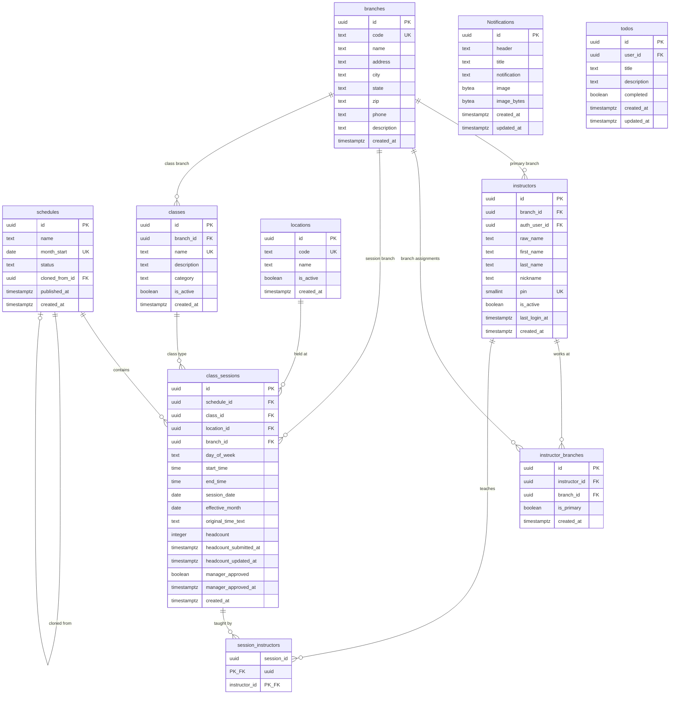
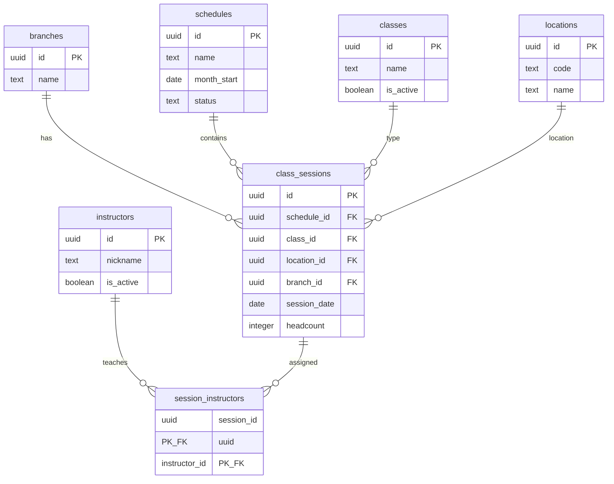
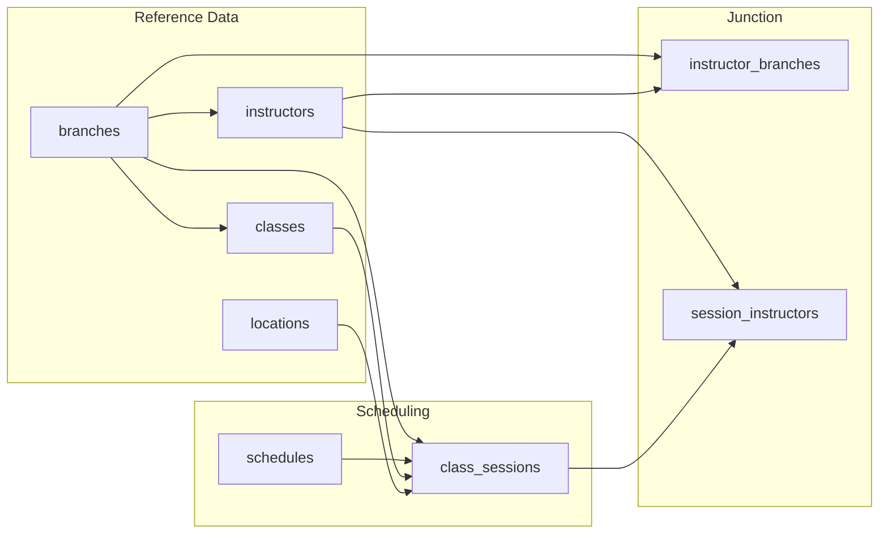

# Supabase ER Diagram (Current Schema)

**Last Updated:** 2025-01-XX  
**Includes:** All migrations through 20251216

## Full Entity Relationship Diagram

## Simplified View (Core Scheduling)

## Relationship Flow

## Key Relationships

| From | To | Cardinality | Delete Behavior |
|------|-----|-------------|-----------------|
| `branches` | `classes` | 1:N | (default) |
| `branches` | `instructors` | 1:N | SET NULL |
| `branches` | `class_sessions` | 1:N | SET NULL |
| `schedules` | `class_sessions` | 1:N | CASCADE |
| `classes` | `class_sessions` | 1:N | RESTRICT |
| `locations` | `class_sessions` | 1:N | RESTRICT |
| `instructors` | `session_instructors` | 1:N | CASCADE |
| `class_sessions` | `session_instructors` | 1:N | CASCADE |
| `instructors` | `instructor_branches` | 1:N | CASCADE |
| `branches` | `instructor_branches` | 1:N | CASCADE |

## Notes

- All tables use UUID primary keys with `gen_random_uuid()` default
- Soft delete implemented via `is_active` column on: `instructors`, `classes`, `locations`
- `class_sessions` references cannot be deleted if sessions exist (RESTRICT)
- `schedules` deletion cascades to all associated sessions
- `session_date` enables tracking individual occurrences within a schedule
- `branch_id` on `class_sessions` and `classes` enables multi-branch support

## See Also

- [Full Schema Documentation](2025-12-14-1148-supabase-schema-documentation.md) - Complete table definitions
- [Database Documentation](2025-12-14-1148-supabase-database-documentation.md) - Setup and usage
- [Environment Flow](2025-12-14-1148-supabase-environment-flow.md) - Dev/staging/prod workflow
