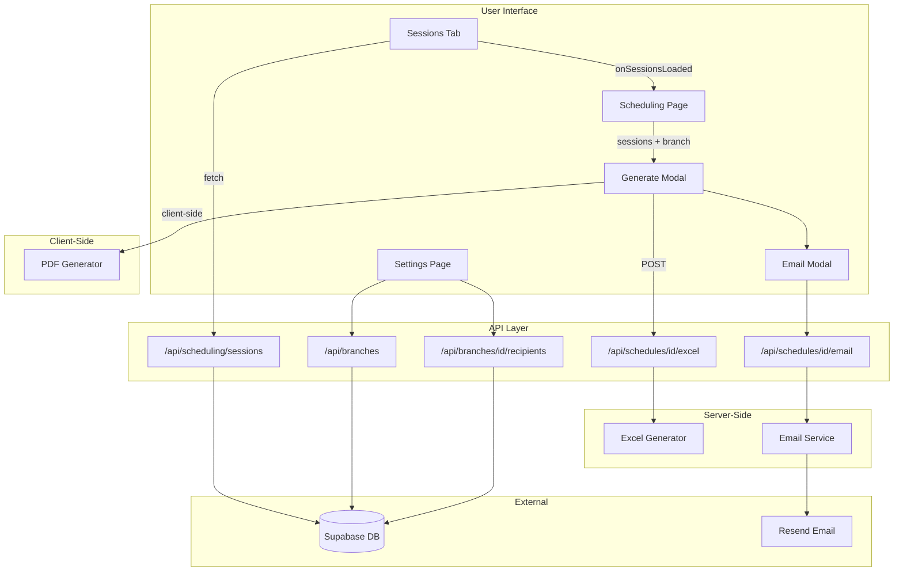

# Print Schedule Feature - Implementation Plan

**Created:** 2025-12-18  
**Status:** Planning Complete  
**Related PRD:** [PRD_Monthly_Schedule_Report.md](PRD_Monthly_Schedule_Report.md)

## Overview

Implement the Monthly Schedule Report Generator with on-demand PDF/Excel generation, preview, download, print, and email capabilities - with per-branch email configuration managed via Settings page.

---

## Key Simplifications (Based on Discussion)

- **No PDF storage** - Generate on-demand instead of storing in Supabase Storage
- **No `legend_description` on locations** - Use existing `name` field
- **No PDF tracking on schedules** - Skip `pdf_storage_path`, `pdf_generated_at`, `pdf_file_size`
- **Defer `schedule_distributions` table** - Add only when implementing email in Phase 5
- **Per-branch email config** - Add email settings to branches table, managed via Settings page
- **Reuse existing sessions data** - Use callback from SessionsTab instead of separate API call

---

## Phase 1: Foundation

### 1.0 Database Migration - Branch Email Config

Create migration `supabase/migrations/YYYYMMDD_add_branch_email_config.sql`:

```sql
-- Add email config columns to branches
ALTER TABLE branches
ADD COLUMN schedule_email_from TEXT,
ADD COLUMN schedule_email_reply_to TEXT,
ADD COLUMN website_url TEXT;

-- Auxiliary recipients table (non-instructors who receive schedules)
CREATE TABLE branch_schedule_recipients (
  id UUID PRIMARY KEY DEFAULT gen_random_uuid(),
  branch_id UUID NOT NULL REFERENCES branches(id) ON DELETE CASCADE,
  email TEXT NOT NULL,
  name TEXT,
  created_at TIMESTAMPTZ DEFAULT NOW(),
  UNIQUE(branch_id, email)
);

CREATE INDEX idx_branch_schedule_recipients_branch 
  ON branch_schedule_recipients(branch_id);
```

**Branches table additions:**

| Column | Purpose |
|--------|---------|
| `schedule_email_from` | "From" address for schedule emails |
| `schedule_email_reply_to` | Reply-to address for recipient responses |
| `website_url` | Branch website URL to display on PDF footer |

**New table `branch_schedule_recipients`:**

| Column | Purpose |
|--------|---------|
| `branch_id` | FK to branches table |
| `email` | Recipient email address |
| `name` | Optional display name |

This table stores auxiliary recipients (front desk, managers, corporate) who are not instructors but should receive schedule emails. Managed via Settings page (Phase 5).

### 1.1 TypeScript Interfaces

Create `web/src/types/schedule-report.ts`:

```typescript
export interface ScheduleReportData {
  branch: { id: string; name: string; address: string; city: string; state: string; phone: string };
  schedule: { id: string; name: string; month_start: string };
  sessions: ScheduleSession[];
  locations: { code: string; name: string }[];
  generatedAt: Date;
}

export interface ScheduleSession {
  day_of_week: string;
  start_time: string;
  end_time: string;
  class_name: string;
  location_code: string;
  instructors: string[];
}

export type ReportFormat = 'pdf' | 'excel';
```

### 1.2 Reuse Existing Sessions Data (Callback Pattern)

Instead of creating a separate data fetcher, reuse the sessions already loaded in `SessionsTab`.

Update `web/src/app/scheduling/sessions-tab.tsx`:

```typescript
// Add callback prop to SessionsTab
type Props = {
  scheduleId: string;
  branchId: string;
  refreshKey: number;
  onSessionsLoaded?: (sessions: Session[]) => void; // NEW
};

// In useEffect after fetching sessions:
setSessions(data.sessions);
onSessionsLoaded?.(data.sessions); // Notify parent
```

Update `web/src/app/scheduling/page.tsx`:

```typescript
// Store sessions for PDF generation
const [sessionsForPrint, setSessionsForPrint] = useState<Session[]>([]);

<SessionsTab
  scheduleId={selectedScheduleId}
  branchId={selectedBranchId}
  refreshKey={refreshKey}
  onSessionsLoaded={setSessionsForPrint}  // Capture sessions
/>
```

### 1.3 Expand Branch Data

The current Branch type only has `{ id, name }`. Expand to include PDF footer fields and email config.

Update `web/src/app/scheduling/page.tsx` Branch type:

```typescript
type Branch = {
  id: string;
  name: string;
  address?: string;
  city?: string;
  state?: string;
  phone?: string;
  website_url?: string;
  schedule_email_from?: string;
  schedule_email_reply_to?: string;
};
```

Update `web/src/app/api/branches/route.ts` to return these fields in the response. Note: `address`, `city`, `state`, `phone` already exist in database; `website_url`, `schedule_email_from`, `schedule_email_reply_to` will be added by migration in Section 1.0.

---

## Phase 2: PDF Generation (Client-Side)

### 2.1 Install Dependencies

```bash
npm install @react-pdf/renderer
```

### 2.2 PDF Document Component

Create `web/src/components/schedule-pdf/SchedulePDFDocument.tsx`:

- Header: Branch name, month/year, contact info
- Body: Sessions grouped by day (Mon-Sun columns or rows)
- Footer: Location key derived from unique `locations` in sessions
- Styling: YMCA brand colors, readable fonts

Props interface:

```typescript
interface SchedulePDFProps {
  branch: Branch;
  schedule: Schedule;
  sessions: Session[];
}
```

### 2.3 PDF Generation Utility

Create `web/src/lib/schedule-pdf-utils.ts`:

- `generateSchedulePDF(branch, schedule, sessions)` - returns PDF blob
- Uses `@react-pdf/renderer`'s `pdf()` function for client-side generation
- Extracts unique locations from sessions for legend
- Groups sessions by day_of_week

Client-side flow (no API call needed for PDF):

```
User clicks "Download PDF"
    → Use sessions already in parent state
    → Use branch data already loaded
    → Generate PDF client-side with @react-pdf/renderer
    → Trigger browser download
```

---

## Phase 3: Modal UI and Preview

### 3.1 Generate Schedule Modal

Create `web/src/components/schedule-report/GenerateScheduleModal.tsx`:

- Format selector: PDF / Excel radio buttons
- Preview button (opens PDF in new tab or iframe)
- Download button
- Print button (uses browser print dialog)
- Close button

### 3.2 Integration

Update `web/src/app/scheduling/page.tsx`:

- Add "Print Schedule" button near branch/schedule selectors
- Opens `GenerateScheduleModal` with current `scheduleId` and `branchId`

---

## Phase 4: Excel Generation (Server-Side)

### 4.1 Install Dependencies

```bash
npm install exceljs
```

### 4.2 Excel Generator API

Create `web/src/app/api/schedules/[id]/excel/route.ts`:

- POST endpoint that receives sessions data in request body
- Uses `exceljs` to create workbook server-side
- Sheet 1: Schedule grid (days as columns, times as rows)
- Header row with branch info
- Auto-column widths, cell styling
- Returns `application/vnd.openxmlformats-officedocument.spreadsheetml.sheet`

```typescript
// POST /api/schedules/{id}/excel
// Body: { branch, schedule, sessions }
// Returns: Excel file blob
```

Note: Excel generation is server-side because `exceljs` works best in Node.js environment.

---

## Phase 5: Email Distribution (Future)

### 5.1 Settings Page - Branch Email Configuration

Create or update `web/src/app/settings/page.tsx`:

**Email Config Section:**

- Branch selector dropdown (if user has access to multiple branches)
- Form fields for:
  - `schedule_email_from` - Email address for sending schedules
  - `schedule_email_reply_to` - Reply-to address for responses
  - `website_url` - Branch website URL (displayed on PDF footer)
- Save button to update branch record
- Email format validation

**Auxiliary Recipients Section:**

- List of current recipients from `branch_schedule_recipients` table
- Add new recipient form (email + optional name)
- Delete button per recipient
- Edit capability for name/email

Create APIs:

`web/src/app/api/branches/[id]/route.ts`:
- PATCH endpoint to update branch email config fields

`web/src/app/api/branches/[id]/recipients/route.ts`:
- GET - List auxiliary recipients for branch
- POST - Add new recipient
- DELETE - Remove recipient

### 5.2 Database Migration - Distribution Tracking

Create `schedule_distributions` table:

```sql
CREATE TABLE schedule_distributions (
  id UUID PRIMARY KEY DEFAULT gen_random_uuid(),
  schedule_id UUID NOT NULL REFERENCES schedules(id),
  branch_id UUID NOT NULL REFERENCES branches(id),
  distribution_type TEXT NOT NULL, -- 'email', 'download', 'print'
  recipient_email TEXT,
  sent_at TIMESTAMPTZ DEFAULT NOW(),
  status TEXT DEFAULT 'sent'
);
```

### 5.3 Email Provider Setup

- Install `resend` package
- Add `RESEND_API_KEY` to environment
- Use `branches.schedule_email_from` as sender (fallback to env default if not set)

### 5.4 Email API Endpoint

Create `web/src/app/api/schedules/[id]/email/route.ts`:

- Accept recipient list
- Fetch branch email config for "from" and "reply-to" addresses
- Generate PDF on-demand
- Send via Resend with PDF attachment
- Log to `schedule_distributions` table

### 5.5 Email Modal Component

Create `web/src/components/schedule-report/EmailScheduleModal.tsx`:

**Recipients list (merged from two sources):**

1. **Instructors** - Fetched from `instructors` + `instructor_branches` for the branch
2. **Auxiliary recipients** - Fetched from `branch_schedule_recipients` table

**UI Features:**

- "Select All" / "Deselect All" buttons
- Grouped display: "Instructors" section and "Other Recipients" section
- Checkboxes to select/deselect individual recipients
- One-time recipient input (add email not in list for this send only)
- Subject line (editable, with default template)
- Message body (editable, with default template)
- Shows configured "from" address (read-only, from branch settings)
- Send button with progress indicator
- Success/error feedback

---

## Architecture Diagram



---

## Implementation Order

| Phase | Deliverable | Complexity |
|-------|-------------|------------|
| 1 | Migration + Types + Sessions Callback + Branch Data | Low |
| 2 | Client-Side PDF Generation | Medium |
| 3 | Modal UI + Integration | Medium |
| 4 | Server-Side Excel Generation | Low |
| 5 | Settings Page + Email Distribution | Medium |

Each phase is independently deployable and testable.

---

## Data Flow Summary

```
Existing: SessionsTab fetches sessions → displays in table
New:      SessionsTab fetches sessions → callback to parent → available for PDF/Excel

PDF:  Client-side generation (no API call, uses data in browser)
Excel: Server-side generation (POST sessions to API, returns Excel blob)
```

---

## Task Checklist

- [ ] **Phase 1: Foundation**
  - [ ] Create database migration for branch email config and auxiliary recipients table
  - [ ] Create TypeScript interfaces in `web/src/types/schedule-report.ts`
  - [ ] Add `onSessionsLoaded` callback to SessionsTab for data reuse
  - [ ] Expand Branch type and API to include address, phone, website_url, email fields

- [ ] **Phase 2: PDF Generation**
  - [ ] Install `@react-pdf/renderer` package
  - [ ] Create PDF document component in `web/src/components/schedule-pdf/`
  - [ ] Create client-side PDF generation utility

- [ ] **Phase 3: Modal UI**
  - [ ] Create `GenerateScheduleModal` component
  - [ ] Add Print Schedule button to scheduling page

- [ ] **Phase 4: Excel Generation**
  - [ ] Install `exceljs` package
  - [ ] Create Excel generator API endpoint

- [ ] **Phase 5: Email Distribution**
  - [ ] Create Settings page for branch email config and auxiliary recipients management
  - [ ] Implement email distribution with Resend


