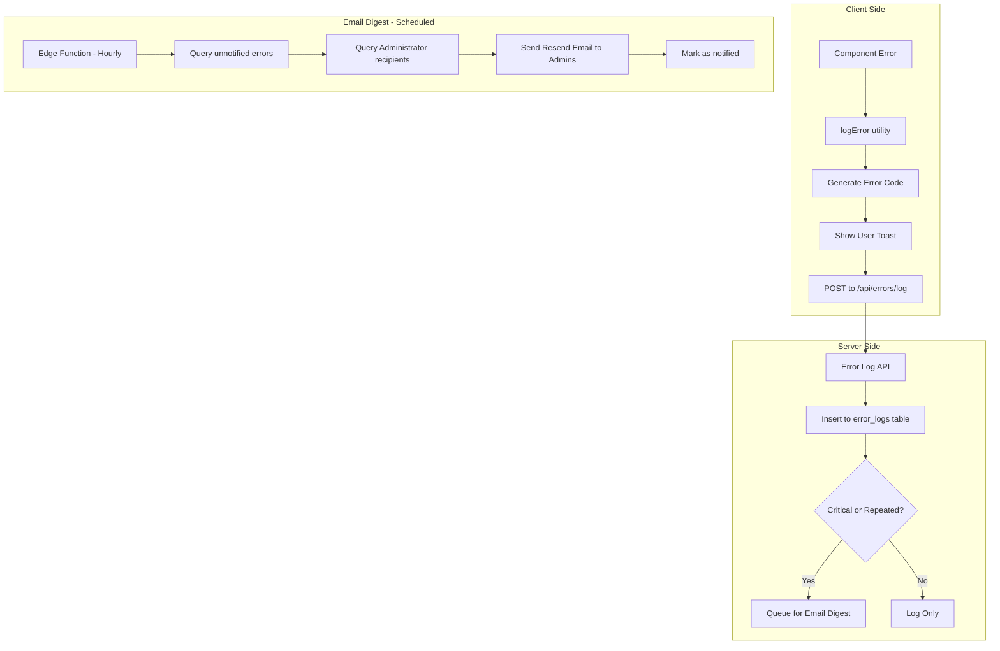

# Production Error Handling System

> **Status:** Draft - Pending Review  
> **Created:** 2026-01-07  
> **Updated:** 2026-01-07 - Added recipient_type for Administrator notifications  
> **Updated:** 2026-01-07 - Added Safe Migration Workflow to prevent container corruption

## Architecture Overview



## Key Principle: Debug vs Production Error Handling

**Production error handling code must be clearly separated from debug instrumentation:**

- Debug logs use `// #region agent log` markers and HTTP calls to debug server
- Production errors use a dedicated `logError()` utility with try/catch
- When removing debug code, look for `#region agent log` markers ONLY
- Production error handling uses standard patterns: `try/catch`, `setError()`, `toast.error()`

---

## Safe Migration Workflow (Prevent Container Corruption)

> **CRITICAL:** Follow this workflow exactly to prevent Docker/Supabase container corruption.

### Pre-Migration: Backup First

```powershell
cd C:\Projects\Cursor\Projects\YMCA\YMCA-Attendance-Web\scripts
.\backup_dev.ps1
```

### Step 1: Create Migration Files

```powershell
cd C:\Projects\Cursor\Projects\YMCA\YMCA-Attendance-Web
supabase migration new add_recipient_type
supabase migration new create_error_logs
```

This creates empty files in `supabase/migrations/` with timestamps.

### Step 2: Edit Migration Files

Add SQL content to each file. All SQL uses safety guards:

| Pattern | Purpose |
|---------|---------|
| `IF NOT EXISTS` | Prevents failure if object already exists |
| `IF EXISTS` | Safe drops that won't fail |
| Check constraints | Named constraints for idempotency |

### Step 3: Apply by Graceful Restart

```powershell
supabase stop
supabase start
```

**NEVER use these commands:**
- `supabase db reset` - Wipes all data, can corrupt state
- `supabase stop --no-backup` - Loses container state
- `docker system prune` - Removes all Docker data

### Step 4: Verify Migration Applied

```powershell
# Check recipient_type column added
docker exec supabase_db_YMCA-Attendance-Web-2 psql -U postgres -d postgres -c "\d branch_schedule_recipients"

# Check error_logs table created
docker exec supabase_db_YMCA-Attendance-Web-2 psql -U postgres -d postgres -c "\d error_logs"

# List applied migrations
supabase migration list
```

### Troubleshooting

| Symptom | Safe Fix |
|---------|----------|
| Migration didn't apply | Check `supabase migration list`, restart again |
| Container unhealthy | `docker restart supabase_db_YMCA-Attendance-Web-2` |
| Port conflict | `netstat -ano \| findstr :55322` |
| Need to rollback | Create NEW migration to undo (never edit applied migrations) |
| Container corrupted | Restore from backup: `.\scripts\backup_dev.ps1` then `supabase start` |

### Golden Rules

1. **NEVER edit an applied migration file** - Create a new one instead
2. **NEVER use `supabase db reset`** unless you want to lose all data
3. **ALWAYS backup before migrations** - Use `.\scripts\backup_dev.ps1`
4. **Use `IF NOT EXISTS`** guards in all CREATE/ALTER statements
5. **Restart to apply** - `supabase stop` then `supabase start`

---

## Implementation Tasks

### 1. Database: Add recipient_type to branch_schedule_recipients

Create migration `supabase/migrations/YYYYMMDD_add_recipient_type.sql`:

```sql
-- Add recipient_type to branch_schedule_recipients for notification routing
-- "Administrator" recipients receive system error notifications (all branches)
-- "Normal" recipients only receive schedule-related emails for their branch

ALTER TABLE branch_schedule_recipients
ADD COLUMN IF NOT EXISTS recipient_type text NOT NULL DEFAULT 'Normal';

-- Add check constraint for valid values
ALTER TABLE branch_schedule_recipients
ADD CONSTRAINT chk_recipient_type 
CHECK (recipient_type IN ('Administrator', 'Normal'));

-- Index for efficient Administrator lookups (error digest)
CREATE INDEX IF NOT EXISTS idx_recipients_type 
ON branch_schedule_recipients (recipient_type) 
WHERE recipient_type = 'Administrator';

COMMENT ON COLUMN branch_schedule_recipients.recipient_type IS 
'Recipient type: Administrator (receives all system errors) or Normal (schedule emails only)';
```

### 2. Database: Create error_logs Table

Create migration `supabase/migrations/YYYYMMDD_error_logs.sql`:

```sql
CREATE TABLE IF NOT EXISTS public.error_logs (
  id uuid PRIMARY KEY DEFAULT gen_random_uuid(),
  error_code text NOT NULL,           -- e.g., "20260107-153045-a1b2c3"
  error_type text NOT NULL,           -- "DB_ERROR", "API_ERROR", "CLIENT_ERROR"
  message text NOT NULL,              -- Technical error message
  
  -- Branch context (for multi-branch tracking)
  branch_id uuid REFERENCES public.branches(id),
  branch_name text,                   -- Denormalized for quick reference in emails
  
  -- User context (for user-specific tracking)
  user_id uuid,                       -- Auth user ID if authenticated
  user_email text,                    -- User email for identification
  
  context jsonb,                      -- Additional context (page, params, etc.)
  stack_trace text,                   -- Stack trace if available
  source text,                        -- "client" or "server"
  url text,                           -- Page/API URL where error occurred
  user_agent text,                    -- Browser info for client errors
  occurrence_count int DEFAULT 1,     -- For grouping repeated errors
  first_occurred_at timestamptz DEFAULT now(),
  last_occurred_at timestamptz DEFAULT now(),
  notified_at timestamptz,            -- When Administrators were notified
  resolved_at timestamptz,            -- When marked resolved
  created_at timestamptz DEFAULT now()
);

-- Index for digest query (unnotified errors)
CREATE INDEX idx_error_logs_unnotified ON public.error_logs (notified_at) WHERE notified_at IS NULL;

-- Index for error grouping
CREATE INDEX idx_error_logs_type_message ON public.error_logs (error_type, message);

-- Index for branch filtering
CREATE INDEX idx_error_logs_branch ON public.error_logs (branch_id);

-- RLS: Allow insert from authenticated and anon, select for service role only
ALTER TABLE public.error_logs ENABLE ROW LEVEL SECURITY;

CREATE POLICY "anon_insert_errors" ON public.error_logs 
  FOR INSERT TO anon WITH CHECK (true);

CREATE POLICY "authenticated_insert_errors" ON public.error_logs 
  FOR INSERT TO authenticated WITH CHECK (true);
  
CREATE POLICY "service_select_errors" ON public.error_logs 
  FOR SELECT TO service_role USING (true);
```

### 3. Utility: Create Error Logger

Create `web/src/lib/error-logger.ts`:

```typescript
type ErrorType = "DB_ERROR" | "API_ERROR" | "NETWORK_ERROR" | "CLIENT_ERROR" | "AUTH_ERROR";

type ErrorContext = {
  page?: string;
  action?: string;
  branchId?: string;
  branchName?: string;
  userId?: string;
  userEmail?: string;
  params?: Record<string, unknown>;
};

// Generate timestamp-based error code: 20260107-153045-a1b2c3
function generateErrorCode(): string {
  const now = new Date();
  const timestamp = now.toISOString().replace(/[-:T]/g, "").slice(0, 14);
  const random = Math.random().toString(36).substring(2, 8);
  return `${timestamp}-${random}`;
}

// Client-side error logging
export async function logError(
  error: Error | string,
  type: ErrorType,
  context?: ErrorContext
): Promise<string> {
  const errorCode = generateErrorCode();
  const message = error instanceof Error ? error.message : error;
  const stackTrace = error instanceof Error ? error.stack : undefined;

  // Log to console for debugging
  console.error(`[${errorCode}] ${type}:`, message, context);

  // Send to server
  try {
    await fetch("/api/errors/log", {
      method: "POST",
      headers: { "Content-Type": "application/json" },
      body: JSON.stringify({
        error_code: errorCode,
        error_type: type,
        message,
        branch_id: context?.branchId || null,
        branch_name: context?.branchName || null,
        user_id: context?.userId || null,
        user_email: context?.userEmail || null,
        context: {
          page: context?.page,
          action: context?.action,
          params: context?.params,
        },
        stack_trace: stackTrace,
        source: "client",
        url: typeof window !== "undefined" ? window.location.href : null,
        user_agent: typeof navigator !== "undefined" ? navigator.userAgent : null,
      }),
    });
  } catch {
    // Silently fail - don't create error loop
    console.error("Failed to log error to server");
  }

  return errorCode;
}

// User-friendly message with error code
export function getUserErrorMessage(errorCode: string): string {
  return `Error ${errorCode} encountered. Please notify AWD Support.`;
}
```

### 4. API: Create Error Logging Endpoint

Create `web/src/app/api/errors/log/route.ts`:

```typescript
import { NextResponse } from "next/server";
import { createSupabaseServerClient } from "@/lib/supabaseServer";

export async function POST(req: Request) {
  try {
    const body = await req.json();
    const supabase = createSupabaseServerClient();

    // Check if similar error exists in last hour (for grouping)
    const oneHourAgo = new Date(Date.now() - 60 * 60 * 1000).toISOString();
    const { data: existing } = await supabase
      .from("error_logs")
      .select("id, occurrence_count")
      .eq("error_type", body.error_type)
      .eq("message", body.message)
      .gte("created_at", oneHourAgo)
      .is("resolved_at", null)
      .limit(1)
      .single();

    if (existing) {
      // Increment occurrence count
      await supabase
        .from("error_logs")
        .update({ 
          occurrence_count: existing.occurrence_count + 1,
          last_occurred_at: new Date().toISOString(),
        })
        .eq("id", existing.id);
    } else {
      // Insert new error
      await supabase.from("error_logs").insert(body);
    }

    return NextResponse.json({ success: true });
  } catch (err) {
    console.error("Error logging failed:", err);
    return NextResponse.json({ error: "Failed to log error" }, { status: 500 });
  }
}
```

### 5. API: Create Error Digest Endpoint

Create `web/src/app/api/errors/digest/route.ts` for sending email digests:

```typescript
import { NextResponse } from "next/server";
import { createSupabaseServerClient } from "@/lib/supabaseServer";
import { Resend } from "resend";

export async function POST(req: Request) {
  // Verify cron secret or admin auth
  const authHeader = req.headers.get("authorization");
  if (authHeader !== `Bearer ${process.env.CRON_SECRET}`) {
    return NextResponse.json({ error: "Unauthorized" }, { status: 401 });
  }

  const supabase = createSupabaseServerClient();
  const resend = new Resend(process.env.RESEND_API_KEY);

  // Get unnotified errors with 3+ occurrences OR any error older than 1 hour
  const { data: errors } = await supabase
    .from("error_logs")
    .select("*")
    .is("notified_at", null)
    .is("resolved_at", null)
    .or("occurrence_count.gte.3,created_at.lt." + new Date(Date.now() - 60 * 60 * 1000).toISOString())
    .order("occurrence_count", { ascending: false });

  if (!errors || errors.length === 0) {
    return NextResponse.json({ message: "No errors to report" });
  }

  // Get Administrator recipients from branch_schedule_recipients
  // Administrators receive ALL system errors regardless of branch
  const { data: admins } = await supabase
    .from("branch_schedule_recipients")
    .select("email, first_name, last_name")
    .eq("recipient_type", "Administrator")
    .eq("on_hold", false);

  if (!admins || admins.length === 0) {
    console.warn("No Administrator recipients configured for error notifications");
    return NextResponse.json({ error: "No Administrator recipients configured" }, { status: 500 });
  }

  const adminEmails = admins.map(a => a.email);

  // Format email with Branch and User info
  const errorSummary = errors.map(e => {
    const branchInfo = e.branch_name ? `Branch: ${e.branch_name}` : "Branch: N/A";
    const userInfo = e.user_email ? `User: ${e.user_email}` : "User: Anonymous";
    return `- [${e.error_code}] ${e.error_type}: ${e.message} (${e.occurrence_count}x)\n  ${branchInfo} | ${userInfo}`;
  }).join("\n\n");

  await resend.emails.send({
    from: "YMCA System <noreply@yourdomain.com>",
    to: adminEmails,
    subject: `[YMCA] Error Digest: ${errors.length} issue(s) require attention`,
    text: `Error Digest - ${new Date().toISOString()}\n\nSent to ${admins.length} Administrator(s)\n\n${errorSummary}\n\nView details in Supabase Studio.`,
  });

  // Mark as notified
  const errorIds = errors.map(e => e.id);
  await supabase
    .from("error_logs")
    .update({ notified_at: new Date().toISOString() })
    .in("id", errorIds);

  return NextResponse.json({ 
    notified: errors.length,
    recipients: adminEmails.length 
  });
}
```

### 6. Update Components with Production Error Handling

Update `web/src/app/scheduling/sessions-tab.tsx`:

```typescript
import { logError, getUserErrorMessage } from "@/lib/error-logger";
import { toast } from "sonner"; // or your toast library

// Inside component, assuming you have selectedBranchId and selectedBranch available
const fetchReferenceData = useCallback(async () => {
  try {
    const [classesRes, locationsRes, instructorsRes] = await Promise.all([
      fetch("/api/maintenance/classes"),
      fetch("/api/maintenance/locations"),
      fetch("/api/maintenance/instructors"),
    ]);
    // ... existing logic ...
  } catch (err) {
    // PRODUCTION ERROR HANDLING - Do not remove
    const errorCode = await logError(
      err instanceof Error ? err : new Error(String(err)),
      "API_ERROR",
      { 
        page: "scheduling", 
        action: "fetchReferenceData",
        branchId: selectedBranchId,
        branchName: selectedBranch?.name,
        // userId and userEmail from auth context if available
      }
    );
    toast.error(getUserErrorMessage(errorCode));
  }
}, [selectedBranchId, selectedBranch]);
```

### 7. Environment Variables

Add to `web/.env.local` and production:

```
CRON_SECRET=your-secure-cron-secret
```

> **Note:** `AWD_SUPPORT_EMAIL` env var is no longer needed - recipients are managed via the Recipients table with `recipient_type = 'Administrator'`

### 8. Scheduled Digest (Optional - Vercel Cron or Edge Function)

For automated hourly digests, add to `vercel.json`:

```json
{
  "crons": [{
    "path": "/api/errors/digest",
    "schedule": "0 * * * *"
  }]
}
```

---

## Recipient Types

| Type | Purpose | Receives |
|------|---------|----------|
| **Administrator** | System administrators / AWD Support | All system error digests (all branches) |
| **Normal** | Branch staff, instructors | Schedule emails for their branch only |

To designate an Administrator:
1. Go to Recipients maintenance
2. Add/edit recipient
3. Set `recipient_type` to "Administrator"

---

## Recommended Actions Reference

| Error Type | User Action | Support Action |
|-----------|------------|----------------|
| DB_ERROR | Refresh page, retry | Check Supabase logs, verify connection |
| API_ERROR | Retry, clear cache | Check API route logs, verify endpoints |
| NETWORK_ERROR | Check connection, retry | Verify server status, check DNS |
| AUTH_ERROR | Re-login | Check auth configuration |
| CLIENT_ERROR | Refresh page | Check browser console, update code |

---

## Debug vs Production Code Guide

When cleaning up debug code, follow these rules:

| Pattern | Action |
|---------|--------|
| `// #region agent log` ... `// #endregion` | REMOVE - Debug only |
| `fetch("http://127.0.0.1:7242/ingest/...")` | REMOVE - Debug server |
| `try { ... } catch { console.error(...) }` | KEEP - Production logging |
| `logError(...)` | KEEP - Production error tracking |
| `toast.error(...)` | KEEP - User notification |
| `setError(...)` | KEEP - UI error state |

---

## Implementation Checklist

- [ ] **BACKUP FIRST:** Run `.\scripts\backup_dev.ps1` before any migrations
- [ ] Create migration to add `recipient_type` to `branch_schedule_recipients`
- [ ] Create `error_logs` table migration with Branch and User fields
- [ ] Apply migrations via `supabase stop` then `supabase start`
- [ ] Verify migrations applied with `\d` commands
- [ ] Create `error-logger.ts` utility with generateErrorCode and logError
- [ ] Create `/api/errors/log` endpoint for receiving client errors
- [ ] Create `/api/errors/digest` endpoint for email notifications to Administrators
- [ ] Add production error handling to `sessions-tab.tsx`
- [ ] Add production error handling to `scheduling/page.tsx`
- [ ] Add `CRON_SECRET` to env
- [ ] Install/configure toast library if not present
- [ ] Update Recipients UI to allow setting recipient_type
- [ ] Designate at least one Administrator recipient for error notifications
