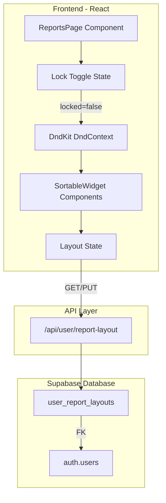
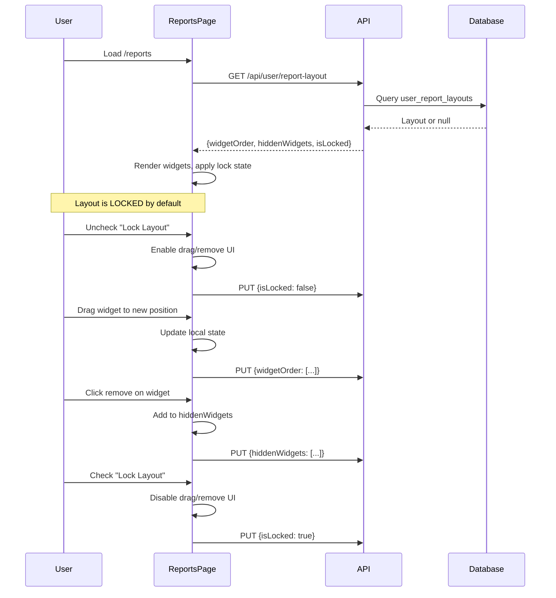

# Customizable Report Widget Dashboard

## Overview

Transform the static reports page into a customizable dashboard where users can drag, drop, remove, and restore report widgets, with layout preferences persisted per authenticated user in Supabase. Includes a lock toggle to prevent accidental changes.

---

## Objectives

1. **Drag-and-Drop Reordering** - Users can drag report widgets to rearrange their dashboard layout
2. **Widget Visibility Control** - Users can hide widgets they don't need and restore them later
3. **Per-User Persistence** - Layout preferences are saved to the database and restored on login
4. **Lock Mode** - A toggle to prevent accidental movement or hiding of widgets
5. **Seamless UX** - Changes auto-save; no explicit "save" button needed

---

## Implementation Todos

| ID | Task | Status |
|----|------|--------|
| db-migration | Create user_report_layouts table migration with is_locked column | pending |
| install-dndkit | Install @dnd-kit/core, @dnd-kit/sortable, @dnd-kit/utilities | pending |
| api-route | Create GET/PUT /api/user/report-layout endpoint with lock state | pending |
| sortable-widget | Create SortableWidget component with drag handle and remove button | pending |
| lock-toggle | Add Lock Layout checkbox toggle to reports page header | pending |
| reports-page | Integrate DndContext, layout state, lock behavior, and auto-save | pending |
| add-widget-ui | Add 'Add Widget' dropdown to restore hidden widgets | pending |

---

## Current State

The reports page (`web/src/app/reports/page.tsx`) has 7 report widgets defined in `ALL_REPORT_SECTIONS`:

| Key | Widget Name |
|-----|-------------|
| `saturdayAverages` | Saturday Avgs |
| `dayTotals` | Day Totals / Day Average |
| `sundayAverages` | Sunday Avgs |
| `monthTotals` | Month Totals |
| `monthClassTypeAverage` | Month Class Type Average |
| `monthClassGroupAverage` | Month Class Group Average |
| `weekTotals` | Week Totals |

Currently rendered in a fixed 3-column grid layout with checkbox selection for PDF export.

---

## Architecture



---

## Implementation Details

### 1. Database Migration

New table `user_report_layouts` to store per-user widget order, visibility, and lock state:

```sql
CREATE TABLE user_report_layouts (
  id UUID PRIMARY KEY DEFAULT gen_random_uuid(),
  user_id UUID NOT NULL REFERENCES auth.users(id) ON DELETE CASCADE,
  widget_order TEXT[] NOT NULL DEFAULT ARRAY[
    'saturdayAverages', 'dayTotals', 'sundayAverages',
    'monthTotals', 'monthClassTypeAverage', 'monthClassGroupAverage', 'weekTotals'
  ],
  hidden_widgets TEXT[] NOT NULL DEFAULT '{}',
  is_locked BOOLEAN NOT NULL DEFAULT TRUE,
  created_at TIMESTAMPTZ DEFAULT NOW(),
  updated_at TIMESTAMPTZ DEFAULT NOW(),
  UNIQUE(user_id)
);
```

Note: `is_locked` defaults to `TRUE` so new users start in a safe, locked state.

### 2. Dependencies

Install `@dnd-kit` packages:
- `@dnd-kit/core` - Core drag-and-drop primitives
- `@dnd-kit/sortable` - Sortable list utilities
- `@dnd-kit/utilities` - CSS transform helpers

### 3. API Route

New endpoint at `web/src/app/api/user/report-layout/route.ts`:

| Method | Purpose |
|--------|---------|
| `GET` | Fetch current user's layout (or defaults if none) |
| `PUT` | Update widget order, hidden widgets, and/or lock state |

### 4. Component Changes

**`web/src/app/reports/page.tsx`**:
- Wrap widget grid with `DndContext` + `SortableContext`
- Convert `Section` component to `SortableWidget` with drag handle
- Add remove (X) button to widget headers (disabled when locked)
- Add "Add Widget" dropdown for restoring hidden widgets (disabled when locked)
- Add layout state management with auto-save (debounced)
- **Add Lock Toggle checkbox** in header controls

**New component**: `web/src/components/sortable-widget.tsx`
- Wraps existing Section with sortable behavior
- Includes drag handle icon (hidden or disabled when locked)
- Includes remove button (hidden or disabled when locked)

---

## Lock Toggle Behavior

| State | Drag Handle | Remove Button | Add Widget Dropdown |
|-------|-------------|---------------|---------------------|
| **Locked** | Hidden/disabled | Hidden/disabled | Disabled |
| **Unlocked** | Visible, draggable | Visible, clickable | Enabled |

**UI Location**: Lock toggle appears in the header area near the existing "Select All / Deselect All" button:

```
[x] Lock Layout    [Select All]    [Add Widget v]    [Export PDF]
```

**Visual Indicator**: When locked, widgets could show a subtle lock icon or muted drag handle to indicate they're protected.

---

## User Flow



---

## UI Mockup

**Header Controls Area:**
```
[x] Lock Layout    Select All / Deselect All    + Add Widget (2 hidden)    [Export PDF]
```

**Widget Header (Unlocked):**
```
[:::] Saturday Avgs                                    [x] [X]
       ^                                                ^   ^
   drag handle                                    PDF   remove
```

**Widget Header (Locked):**
```
[lock icon] Saturday Avgs                              [x]
                                                        ^
                                               PDF checkbox only
```

---

## Fallback Behavior

- **Not logged in**: Use localStorage for layout (no DB persistence), default locked
- **API error**: Gracefully fall back to default layout, don't block UI
- **New user**: Initialize with default widget order, nothing hidden, locked by default

---

## Files to Create/Modify

| File | Action |
|------|--------|
| `supabase/migrations/2025XXXX_user_report_layouts.sql` | Create |
| `web/package.json` | Add @dnd-kit dependencies |
| `web/src/app/api/user/report-layout/route.ts` | Create |
| `web/src/components/sortable-widget.tsx` | Create |
| `web/src/app/reports/page.tsx` | Modify |


