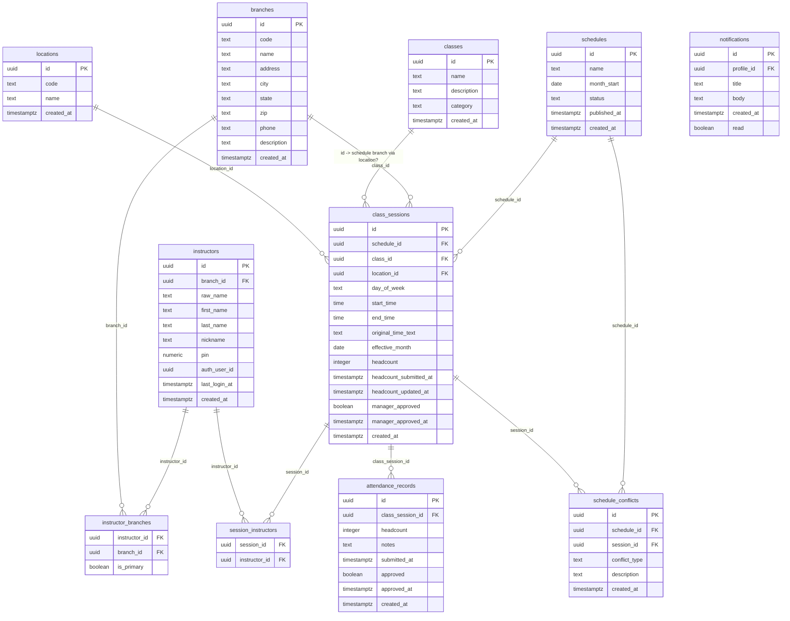

# Supabase ER Diagram (dev/staging/prod schema baseline)

Notes:
- Keys/relationships reflect the baseline schema from `supabase/migrations/20251212_baseline.sql` and project documentation.
- `attendance_records`, `schedule_conflicts`, and `notifications` are included as optional tables referenced in the PRD/workflow diagrams; adjust to match the live schema if they differ.
- For the most accurate view, you can also visualize via a DB client (e.g., DBeaver/pgAdmin) using the local dev database started by `supabase start` (host `127.0.0.1`, port `54322`, user/password `postgres`). 

